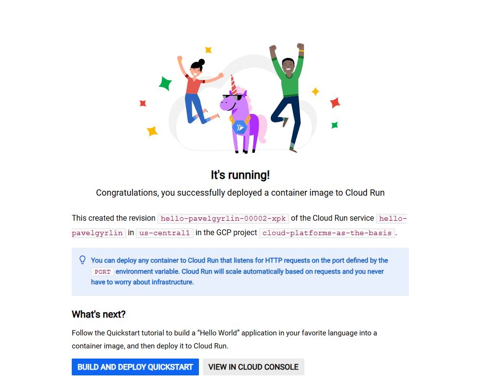
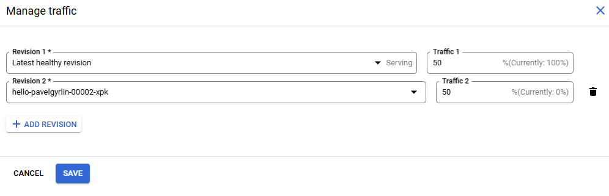

# Лабораторная работа №2 "Исследование Cloud Run"
University: ITMO University

Faculty: FICT

Course: Cloud platforms as the basis of technology entrepreneurship

Year: 2024/2025 

Group: U4225

Author: Gyrlin Pavel Mikhailovich

Lab: Lab2

Date of create: 06.11.2024

Date of finished: 07.11.2024

## Цель работы
Ознакомиться с работой Cloud Run
## Ход работы
* Создайте Cloud Run из представленного дефолтного сервиса Hello с минимальным количеством ресурсов;
* Перейдите по ссылке предоставленной Cloud Run, протестируйте сервис;
* Перейдите в разделы логи и метрики, проанализируйте их;
* Измените ваш Cloud Run, поменяв порт на 8090, посмотрите что произойдет;
* Попробуйте попереключать трафик между версиями, сравните результаты работы;
* Удалить за собой все созданные сервисы, написать отчет с использованием скриншотов.

## Результат
1. Создадим Cloud Run из дефолтного сервиса Hello с мин. количество ресурсов

2. Переходим по сгенерированной ссылке из Cloud Run и видим, что сервис работает!

3. Обратимся к метрикам и увидим показатели: количество затраченных байтов, число запросов к сервису и максимальное количество запросов. Однако пока не отобразился объём входящего трафика и не появилась метрика, которая измеряет время, необходимое для запуска контейнера. Это связано с тем, что контейнер только что создан, и у нас ещё нет достаточной информации.

В логах же мы видим информацию об успешном запуске сервиса и о временных показателях

4. Давайте поменяем порт с 8080 на 8090 и проверим работу сервиса!

Мы мега классные ребята и у нас все работает!

5. Если же мы решим поменять трафик, то он перераспределиться между версиями в определенном соотношении (60/40, 50/50)

# Вывод
В рамках лабораторной работы мы разработали две версии стандартного сервиса «Hello» с разными портами: 8080 и 8090. Обе версии функционируют корректно. Мы можем настроить распределение трафика, чтобы определить, на какую версию будет направлен запрос. Также доступны вкладки с метриками и логами, которые позволяют детально изучить работу сервиса: выявить ошибки, проанализировать использование ресурсов, количество пользователей, объём передаваемых данных, время запуска и прочее.