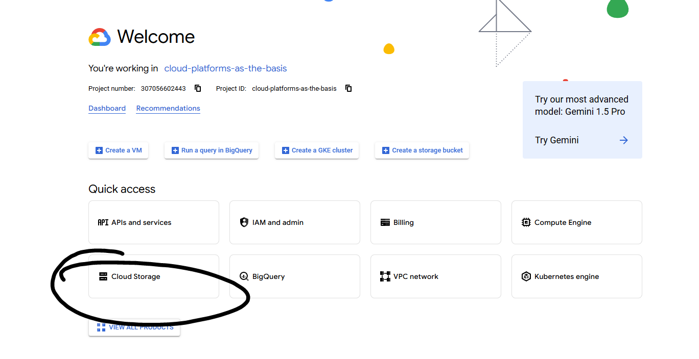
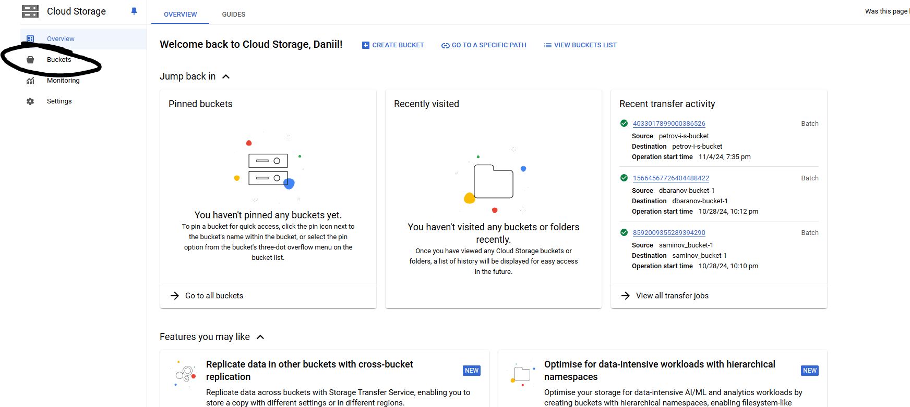
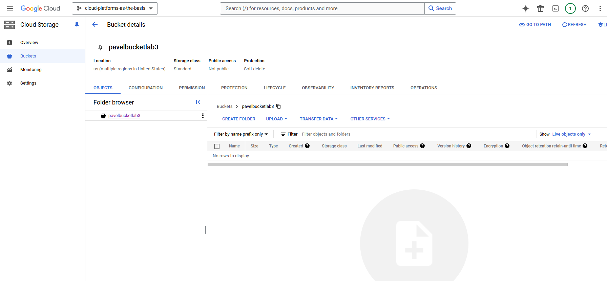
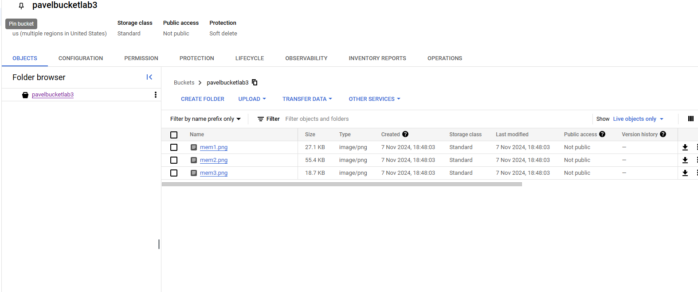
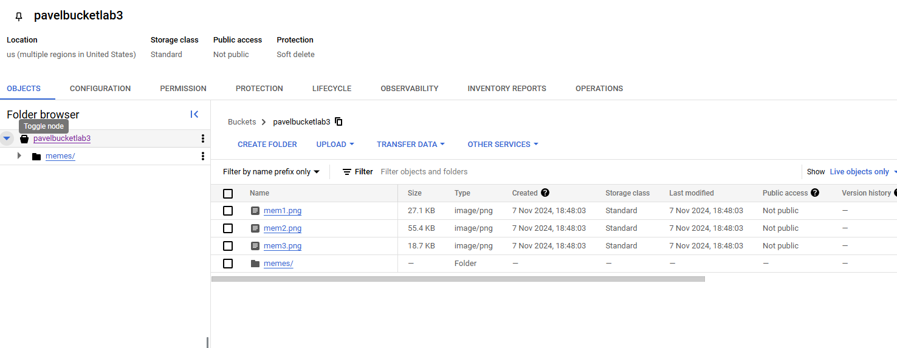
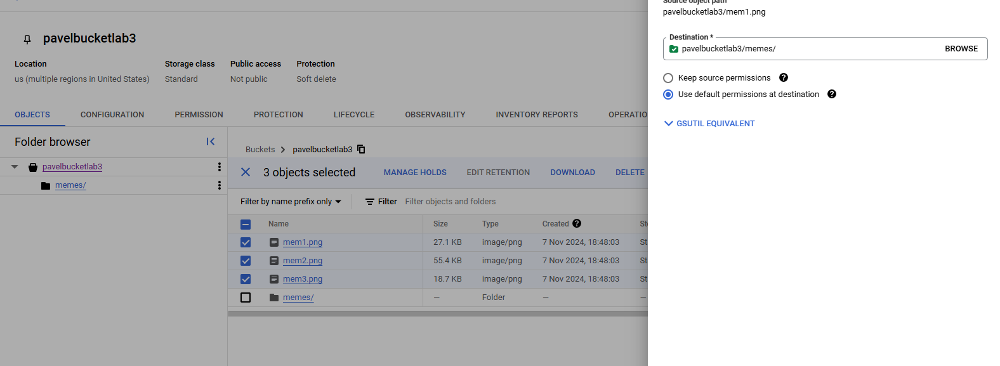
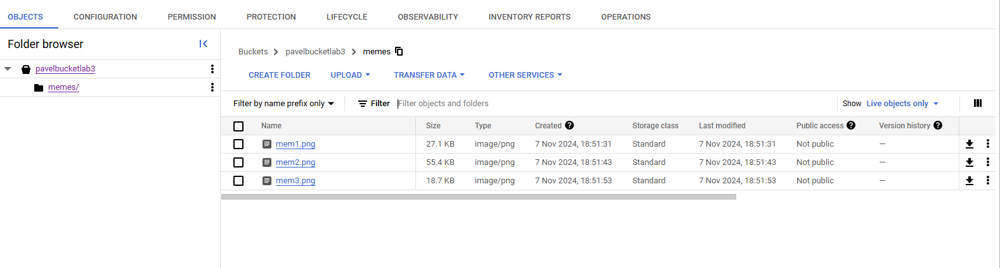
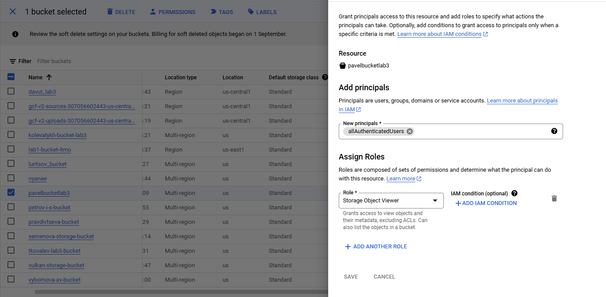
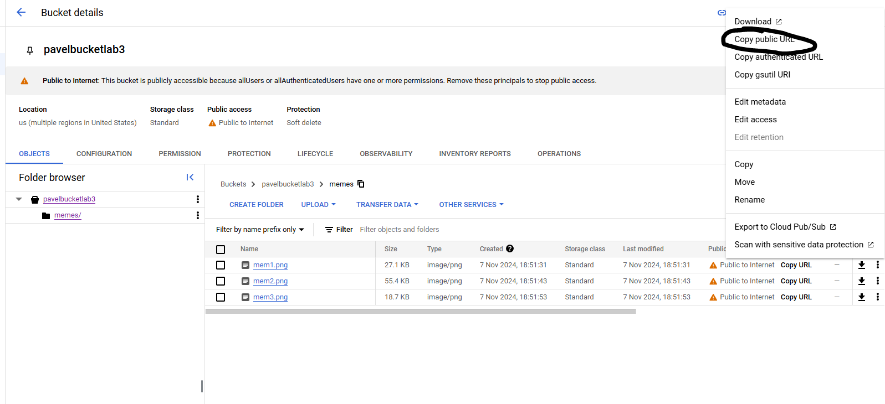
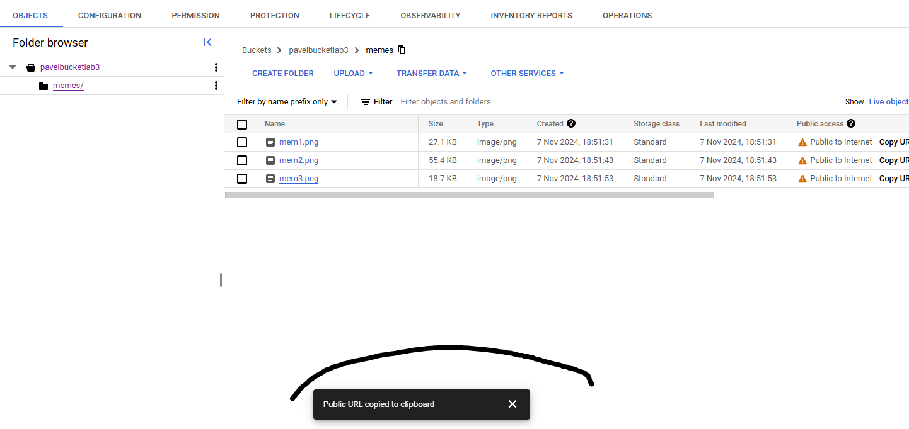

# Лабораторная работа №3 "Исследование Cloud Storage"
University: ITMO University

Faculty: FICT

Course: Cloud platforms as the basis of technology entrepreneurship

Year: 2024/2025 

Group: U4225

Author: Gyrlin Pavel Mikhailovich

Lab: Lab3

Date of create: 06.11.2024

Date of finished: 07.11.2024

## Цель работы
Ознакомиться с основными понятиями и принципами работы облачного хранилища, изучить различные модели хранения данных (блок, файл, объектное хранилище), познакомиться с основными сервисами и функционалом, предоставляемым облачными хранилищами.
## Ход работы
1. Выбрать существующий проект, в котором у вас есть соответствующие разрешения;
2. Создать Cloud Storage bucket;
3. Загрузить 3-4 любых изображения в Cloud Storage bucket;
4. Создать папку с любым названием и переместить файлы туда в пределах бакета;
5. Настроить публичный доступ для ваших файлов в настройках приватности;
6. Создать ссылку на ваши файлы через контекстное меню файла;
7. Удалить за собой все созданные сервисы, написать отчет с использованием скриншотов.

## Задание 1
### Для этого задания я выбрал проект курса, так как у нас есть там соответствующие полномочия. Создаем Cloud Storage bucket.
Переходим в `Cloud Storage`

Далее, кликаем по `Buckets`

Создаем свой бакет по названием `pavelbucketlab3`

## Задание 2
### Подгружаем 3 картинки в bucket и создаем папку, куда и перемещаем их
Подгрузили картинки

Создаем папку `memes`

Используем функцию `Move` для каждого изображения, чтобы его переместить в папку

Изображения находятся в папке `memes`

## Задание 3
### Сейчас мы поменяем доступ бакета с private на public

## Задание 4
### Создадим ссылку на файл через контекстное меню файла и приложим ссылку-пример
#### Пример: https://storage.googleapis.com/pavelbucketlab3/memes/mem1.png

# Вывод 
В ходе работы мы выбрали существующий проект, для которого у нас были необходимые разрешения. Затем создали Cloud Storage bucket и загрузили в него 3 изображения. После этого создали папку и переместили туда файлы. Настроили публичный доступ к файлам через настройки приватности. Сформировали ссылки на файлы с помощью контекстного меню.

В результате мы успешно выполнили все поставленные задачи и получили опыт работы с облачным хранилищем. Теперь мы можем легко загружать, перемещать и предоставлять публичный доступ к своим файлам в облачном хранилище. Это может быть полезно для обмена файлами с другими пользователями или для хранения данных, которые должны быть доступны из любого места.