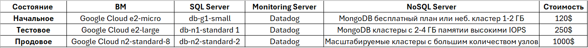

# Лабораторная работа №4 "Разработка инфраструктуры MVP AI приложения."
University: ITMO University

Faculty: FICT

Course: Cloud platforms as the basis of technology entrepreneurship

Year: 2024/2025 

Group: U4225

Author: Gyrlin Pavel Mikhailovich

Lab: Lab4

Date of create: 06.11.2024

Date of finished: 07.11.2024

## Ход работы
Во время выполнения данной работы была сконструирована инфраструктура для AI-приложения спортивного магазина одежды. Каждый компонент схемы был обоснован, и разработана экономическая модель.

### Компонентные составляющие архитектуры 
* Пользователи - доступ к приложению через веб и мобильные приложения;
* Frontend UI - взаимодействие с пользователями через интерфейс;
* API Gateway - все запросы от пользователей направляются через API Gateway, который маршрутизирует запросы к соответствующим микросервисам.
* Product Service — управляет данными о товарах (цены, описание, изображения);
* Cart and Order Service — управляет процессом добавления товаров в корзину и оформления заказов;
* Recommendation Service — сервис для персонализированных рекомендаций, использующий модели AI для анализа поведения пользователя и его предпочтений;
* Search and Filter - позволяет пользователям искать товары по ключевым словам, категориям, применяя фильтры;
* Analytics & Report — собирает и анализирует данные о покупках, предпочтениях пользователей, и генерирует отчеты;
* SQL DB - используется для хранения информации о товарах, пользователях и заказах;
* NoSQL DB - используется для кеширования и хранения сессий пользователей;
* Cloud Storage — хранение данных для обучения и обработки;
* Сервер мониторинга - используется для мониторинга целостности системы и управления логами.

### Экономическая модель и обоснование выбора ресурсов

## Обоснование выбора ресурсов 
1. **Начальный этап**.
На этом этапе система еще не имеет большого количества пользователей, задачи включают создание минимального жизнеспособного продукта (MVP), а также тестирование функциональности. Для начального этапа можно использовать виртуальные машины среднего уровня с минимальными требованиями к ресурсам (CPU, RAM);
2. **Тестовый этап**. 
Тестирование приложения с реальными пользователями, сбор обратной связи, оптимизация и подготовка к масштабированию. Нагрузочное тестирование и улучшение производительности. На данном этапе необходимо усилить вычислительные ресурсы для поддержки роста трафика и нагрузки;
3. **Тестовый этап**. 
Полноценное развертывание системы на большом количестве пользователей с высокими требованиями к производительности и масштабируемости. Оптимизация базы данных и машинного обучения.На продовом этапе система должна поддерживать значительный трафик и высокую нагрузку, поэтому вычислительные машины должны иметь ~4–8 vCPUs и ~16–32 GB RAM для обеспечения стабильной работы. 
# Вывод
На начальной стадии разработки приложения и его запуска можно выбрать минимальные вычислительные мощности, чтобы протестировать базовые функции на ограниченной выборке клиентов, проверяя, функционирует ли сама платформа.
В процессе тестирования, когда будет расширяться функционал, можно увеличить ресурсы для проверки работы платформы при среднем потоке пользователей, чтобы убедиться в ее стабильности и предотвратить сбои.
Для дальнейшей эксплуатации важно выбрать более мощные ресурсы, чтобы обеспечить необходимую пропускную способность, минимизировать риски появления дефектов и сбоев, которые могут привести к серьезным последствиям, включая финансовые потери, упущенную выгоду, а также ухудшение репутации и увеличение рисков.