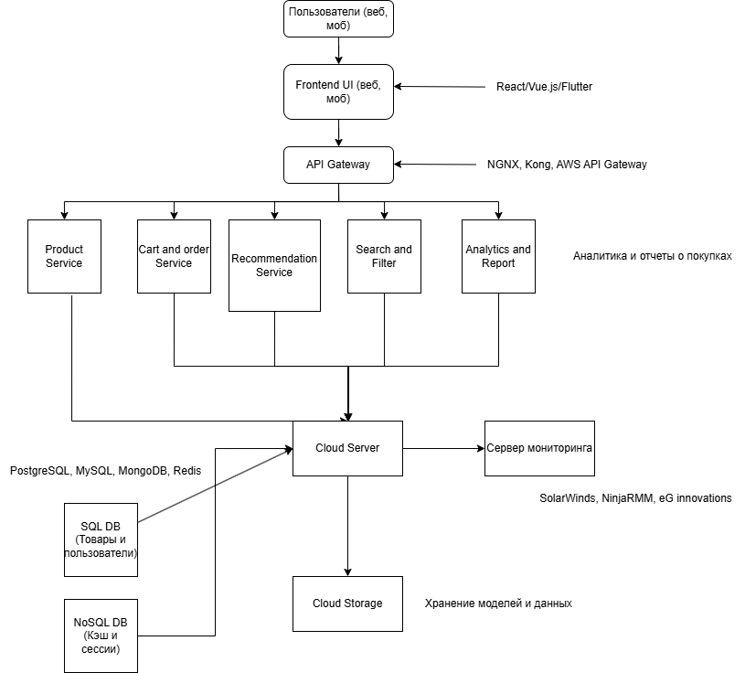

University: ITMO University

Faculty: FICT

Course: Cloud platforms as the basis of technology entrepreneurship

Year: 2024/2025 

Group: U4225

Author: Gyrlin Pavel Mikhailovich

Lab: Lab1

Date of create: 06.11.2024

Date of finished: 07.11.2024

## Ход работы
Во время выполнения данной работы была сконструирована инфраструктура для AI-приложения спортивного магазина одежды. Каждый компонент схемы был обоснован, и разработана экономическая модель.

### Компонентные составляющие архитектуры 
* Пользователи - доступ к приложению через веб и мобильные приложения;
* Frontend UI - взаимодействие с пользователями через интерфейс;
* API Gateway - все запросы от пользователей направляются через API Gateway, который маршрутизирует запросы к соответствующим микросервисам.
* Product Service — управляет данными о товарах (цены, описание, изображения);
* Cart and Order Service — управляет процессом добавления товаров в корзину и оформления заказов;
* Recommendation Service — сервис для персонализированных рекомендаций, использующий модели AI для анализа поведения пользователя и его предпочтений;
* Search and Filter - позволяет пользователям искать товары по ключевым словам, категориям, применяя фильтры;
* Analytics & Report — собирает и анализирует данные о покупках, предпочтениях пользователей, и генерирует отчеты;
* SQL DB - используется для хранения информации о товарах, пользователях и заказах;
* NoSQL DB - используется для кеширования и хранения сессий пользователей;
* Cloud Storage — хранение данных для обучения и обработки;
* Сервер мониторинга - используется для мониторинга целостности системы и управления логами.